<h1 align="center">📒 Profiling and Integrating CUDA kernels in PyTorch 学习笔记</h1>


## 概述
系列课程的三个主持人：

- Andreas Köpf

- Thomas Viehmann

- Mark Saroufim


课程安排：每两周出一个Topic

对于课程来说，会有几个侧重点：

- 偏向于教科书的形式，参考书籍：《[Programming Massively Parallel Processors](https://www.amazon.com/Programming-Massively-Parallel-Processors-Hands/dp/0323912311/ref=sr_1_1?crid=60S1S1SMZ3RT&keywords=programming+massively+parallel+processors+4th+edition&qid=1704978852&s=books&sprefix=programming+massively+parallel+processors+4th+edition%2Cstripbooks%2C131&sr=1-1&ufe=app_do%3Aamzn1.fos.18ed3cb5-28d5-4975-8bc7-93deae8f9840)》

- 应用型编程

- 专题课题：使用CUDA做的项目。

所以对于课程的受众来说，更多希望让很多阅读教程后又感觉在原地打转死循环的人。至于为什么会死循环？

- 需要学习大量的基本术语
- 学习GPU的基本工作原理及其术语
- 学习GPU编程模型
- 学习C/C++，这个对于学习PyTorch的用户来说是必备的事项。

所以学习一个教程来说，都需要花费很多时间。如果一个用户要去解决问题，也需要花费时间。例如：一个PyTorch程序，如何将一个性能很不错的CUDA程序也嵌入到程序中？如何进行Profile？ 这也是这个Lecture的目的。

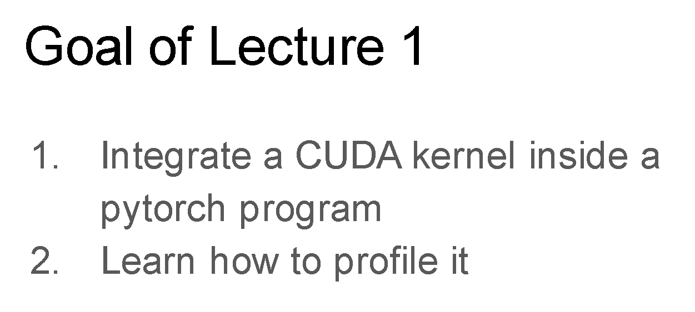

对于一个程序来说，如果使用性能分析工具，通过可视化的方式来分析和理解它，可能会相对容易且不枯燥。通过黑盒的方式，不需要去理解GPU或者CUDA的所有细节，就可以直接用它去解决一些特定需求的Task。

> 课程代码新地址：https://github.com/gpu-mode/profiling-cuda-in-torch


## PyTorch autograd profiler 案例

Slide 中代码地址：https://github.com/gpu-mode/profiling-cuda-in-torch/blob/main/pytorch_square.py

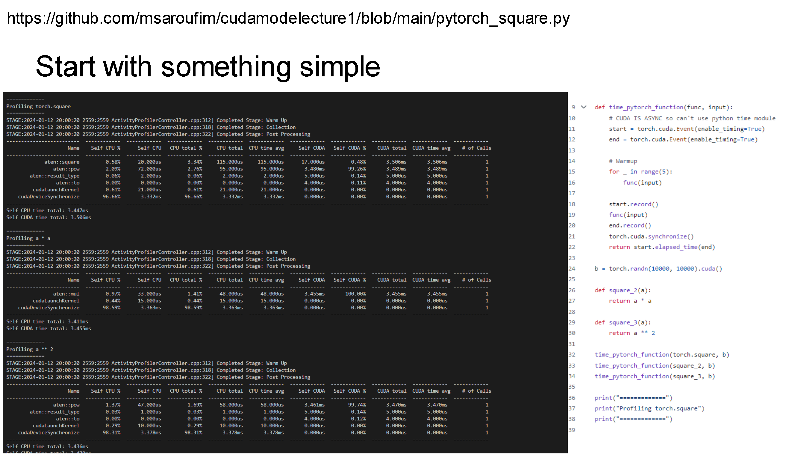


一个点对点运算的例子：

> 对于点对点的运算，也有softmax函数、sin、cos等都是属于点对点计算的典型例子。

```python
import torch

a = torch.tensor([1., 2., 3.])

print(torch.square(a))
print(a ** 2)
print(a * a)

def time_pytorch_function(func, input):
    # CUDA IS ASYNC so can't use python time module
    # CUDA的异步问题，所以使用CUDA Event
    # 如果只使用Python的time模块，只是测量启动kernel的开销，而不是kernel实际消耗的时间
    start = torch.cuda.Event(enable_timing=True)
    end = torch.cuda.Event(enable_timing=True)

    # Warmup
    # 第一次在PyTorch函数中调用CUDA时，需要提前warmup，因为会初始化CUDA context
    for _ in range(5):
        func(input)

    start.record()
    func(input)
    end.record()
    # CUDA同步操作，因为异步机制
    torch.cuda.synchronize()
    return start.elapsed_time(end)

b = torch.randn(10000, 10000).cuda()

# 逐元素的平方（elementwise）
# 如果是矩阵中，遍历元素乘以自身
def square_2(a):
    return a * a

def square_3(a):
    return a ** 2

time_pytorch_function(torch.square, b)
time_pytorch_function(square_2, b)
time_pytorch_function(square_3, b)

print("=============")
print("Profiling torch.square")
print("=============")

# Now profile each function using pytorch profiler
# 原代码中，使用 use_cuda=true，现已替换 use_device = 'cuda'
with torch.autograd.profiler.profile(use_device = 'cuda') as prof:
    torch.square(b)

print(prof.key_averages().table(sort_by="cuda_time_total", row_limit=10))

print("=============")
print("Profiling a * a")
print("=============")

with torch.autograd.profiler.profile(use_device = 'cuda') as prof:
    square_2(b)

print(prof.key_averages().table(sort_by="cuda_time_total", row_limit=10))

print("=============")
print("Profiling a ** 2")
print("=============")

with torch.autograd.profiler.profile(use_device = 'cuda') as prof:
    square_3(b)

print(prof.key_averages().table(sort_by="cuda_time_total", row_limit=10))
```

通过PyTorch中实现平方函数，然后使用PyTorch自带的autograd profiler工具来进行profile的分析。对于函数 `time_pytorch_function ` 这个计数函数的功能和 `autograd.profiler.profile` 是类似的操作。

在本地环境调试完成后，具体的如下：

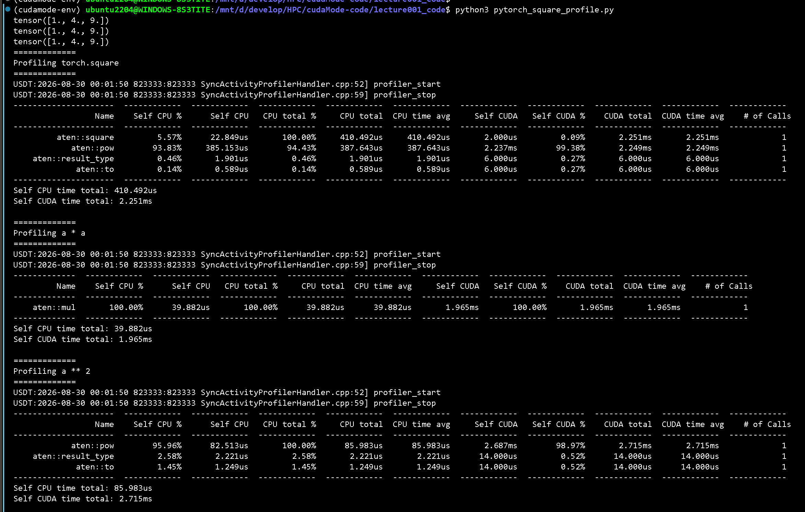

图中展示了Kernel在CPU上相对于GPU的时间开销，以及总时间开销，还有展示每个kernel被调用的次数。

- `Profiling torch.square` 情况
    - Aten : 类似于PyTorch中的底层C++方言。低于程序来说，并没有直接调用square函数，而是调用pow函数

- `Profiling a * a` 情况

    - 没有调用pow函数，而是直接使用乘法运算
    - 时间上乘法运算比幂运算快一点

- `Profiling a ** 2` 情况

    - 使用了Python内置的就直接调用Aten中pow函数

## PyTorch Profiler 案例

PyTorch Profiler 是一个可视化的分析器，和autograd profile的方式不一样。它本质上将一个json文件放到浏览器中，会将其数据可视化。

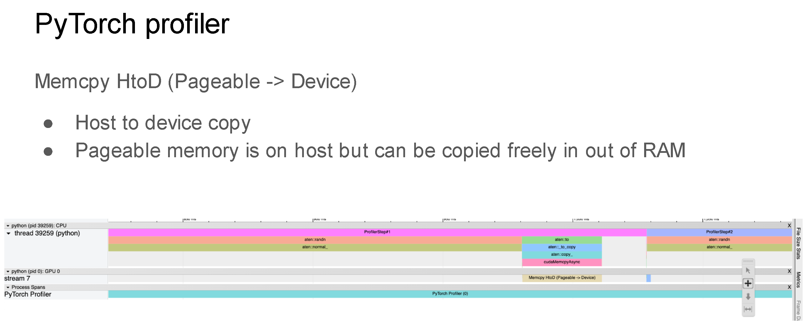

- HtoD：就是CUDA中内存拷贝从Host到Device。

主要对代码进行分析说明。代码地址：https://github.com/gpu-mode/profiling-cuda-in-torch/blob/main/pt_profiler.py

我在本地测试时，安装Tensorboard和对应的Python依赖：

```shell
python3 -m pip install tensorboard tensorboard-plugin-profile torch-tb-profiler -i https://mirrors.tuna.tsinghua.edu.cn/pypi/web/simple
```

在安装完成后，改代码

```python
    # on_trace_ready=trace_handler
    # 使用这一行的方式，不使用export_chrome_trace
    on_trace_ready=torch.profiler.tensorboard_trace_handler('./log')
```

开始执行程序，进行可视化的结果：

```shell
python3 pytorch_profiler.py

tensorboard --logdir=./log
```

点击 http://localhost:6006/ 后显示如下：

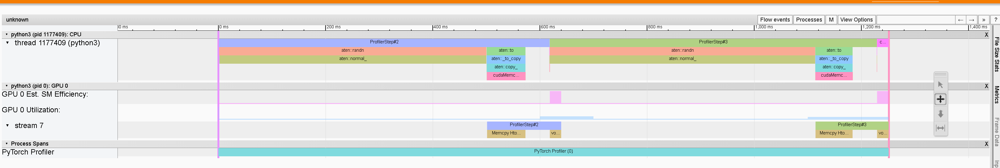

然后开始对PyTorch的案例elementwise进行测试，PyTorch 2.11开始对Caffe代码移除。所以最新的代码地址：https://github.com/pytorch/pytorch/blob/main/aten/src/ATen/native/cuda/CUDALoops.cuh

演示代码：

```python
import torch
from torch.profiler import profile, record_function, ProfilerActivity

x = torch.randn(10000, 10000, device='cuda')

with torch.profiler.profile(
    activities=[ProfilerActivity.CPU, ProfilerActivity.CUDA],
    on_trace_ready=torch.profiler.tensorboard_trace_handler('./log'),
    record_shapes=True,
    # with_stack=True, # 捕获调用栈，可以查看 Python -> C++ 的调用链
) as prof:
    with record_function("torch.square"):
        torch.square(x)
    with record_function("a*a"):
        x * x
    with record_function("a**2"):
        x ** 2
```

可视化后的结果如下：

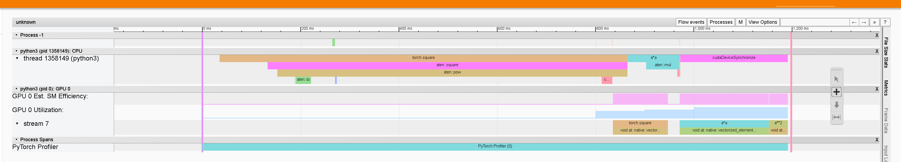

- 从图中可以看到， `torch.square` 调用通过多层封装，实际上调用的是 `aten::pow` , 所以 `torch.square` 在 ATen 层并不是调用专门的 square kernel，而是复用了通用的 pow(x, 2) 实现，带来了额外的调度开销。

- 三个方式最终都是会调用 vectorized_elementwise_kernel（图中Stream 7）。

    ```c
    // 4表示Block的数量
    void at::native::vectorized_elementwise_kernel<4, at::native::BinaryFunctor<float, float, float, at::native::binary_internal::MulFunctor<float> >, std::array<char*, 3ul> >(int, at::native::BinaryFunctor<float, float, float, at::native::binary_internal::MulFunctor<float> >, std::array<char*, 3ul>)
    ```

但是这里存在一个问题，只可以看到调用的函数，不知道kernel到底有多快？可以如何优化改进？

具体的CUDA案例也可以直接去看PyTorch中Aten目录中不同种类的 `.cu` 代码：https://github.com/pytorch/pytorch/tree/main/aten/src/ATen/native/cuda

所以看教科书类型的Kernel书籍，不如直接看偏向于应用机器学习的实际代码。

## 回到主题：如何在PyTorch中集成一个CUDA内核？

几种方式：

- Pytorch中 `load_inline` 函数。

- Python方式，使用numba

- triton 方式


### Pytorch中 load_inline 函数方式集成

CUDA 一般是使用C/C++编写的。所以换句话说，如何在Python代码中加载一个C++函数？所以就需要使用 pybind，来为C++文件创建Python绑定。

在PyTorch中，可以使用 `load_inline` 函数把c/c++源码以函数的方式加载到模块中。

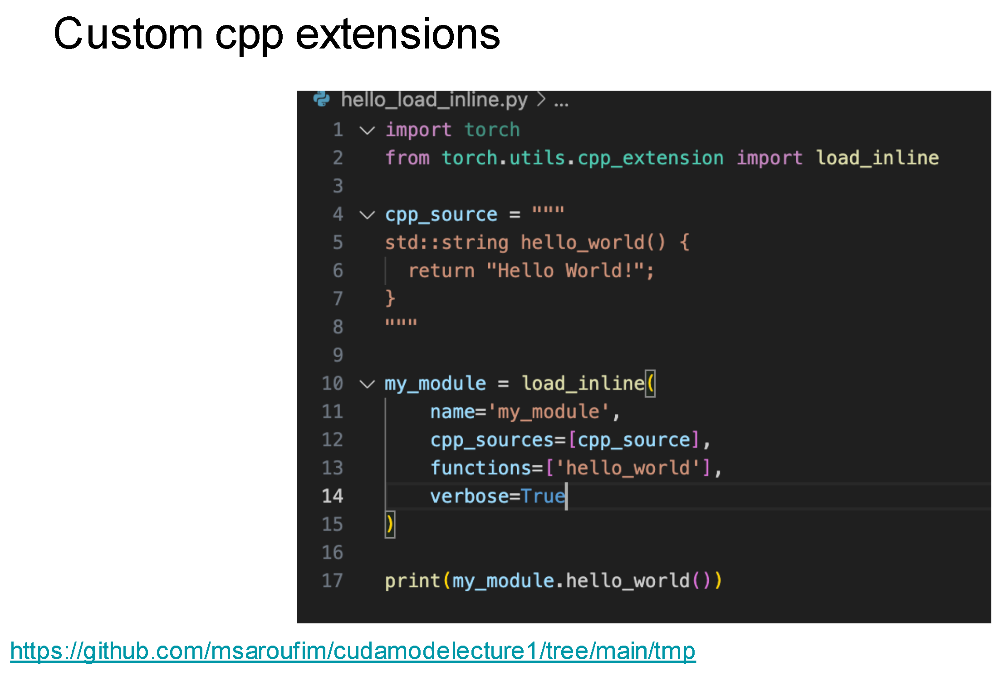

对于底层代码来说，它会直接创建一个暂存目录，也就是`./tmp`目录，在目录下面就会生成一个`main.cpp`文件（也就是对应的pybind函数）。

```cpp
#include <torch/extension.h>

std::string hello_world() {
    return "Hello World!";
}

PYBIND11_MODULE(TORCH_EXTENSION_NAME, m) {
    m.def("hello_world", torch::wrap_pybind_function(hello_world), "hello_world");
}
```

另外，在tmp目录下，也会创建生成一个 `build.ninja` 构建文件，通过这个文件，为代码文件生成类似makefile的编译。


通过使用 `load_inline` 函数来加载CUDA代码（案例：方阵（square matrix）），源代码：https://github.com/gpu-mode/lectures/blob/main/lecture_001/load_inline.py

```python
# Look at this test for inspiration
# https://github.com/pytorch/pytorch/blob/main/test/test_cpp_extensions_jit.py

import torch
from torch.utils.cpp_extension import load_inline

# Define the CUDA kernel and C++ wrapper
cuda_source = '''
__global__ void square_matrix_kernel(const float* matrix, float* result, int width, int height) {
    int row = blockIdx.y * blockDim.y + threadIdx.y;
    int col = blockIdx.x * blockDim.x + threadIdx.x;

    if (row < height && col < width) {
        int idx = row * width + col;
        result[idx] = matrix[idx] * matrix[idx];
    }
}

torch::Tensor square_matrix(torch::Tensor matrix) {
    const auto height = matrix.size(0);
    const auto width = matrix.size(1);

    auto result = torch::empty_like(matrix);

    dim3 threads_per_block(16, 16);
    dim3 number_of_blocks((width + threads_per_block.x - 1) / threads_per_block.x,
                          (height + threads_per_block.y - 1) / threads_per_block.y);

    square_matrix_kernel<<<number_of_blocks, threads_per_block>>>(
        matrix.data_ptr<float>(), result.data_ptr<float>(), width, height);

    return result;
    }
'''

cpp_source = "torch::Tensor square_matrix(torch::Tensor matrix);"

# Load the CUDA kernel as a PyTorch extension
square_matrix_extension = load_inline(
    name='square_matrix_extension',
    cpp_sources=cpp_source,
    cuda_sources=cuda_source,
    functions=['square_matrix'],
    with_cuda=True,
    # 可能会出现CUDA和pytorch中的C++版本不兼容。可以增加指定C++版本
    extra_cuda_cflags=["-O2", '--expt-relaxed-constexpr'],
    build_directory='./load_inline_cuda',
)

a = torch.tensor([[1., 2., 3.], [4., 5., 6.]], device='cuda')
print(square_matrix_extension.square_matrix(a))

# (cudamode-env) ubuntu2204@WINDOWS-8S3TITE:/mnt/d/develop/HPC/cudaMode-code/lecture001_code$ python3 pytorch_load_inline.py 
# tensor([[ 1.,  4.,  9.],
#         [16., 25., 36.]], device='cuda:0')
```

执行文件后，会生成对应的 `cuda` 文件 和 对应的 `pybind` 绑定函数的 `main.cpp` 文件。

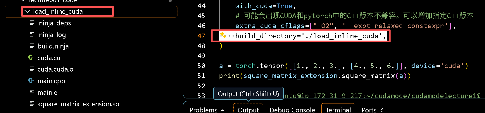

### numba方式集成CUDA内核

对于numba 方式，和CUDA编程方式差不多类似。

```python
from numba import cuda

# CUDA kernel
@cuda.jit
def square_matrix_kernel(matrix, result):
    # Calculate the row and column index for each thread
    row, col = cuda.grid(2)

    # Check if the thread's indices are within the bounds of the matrix
    if row < matrix.shape[0] and col < matrix.shape[1]:
        # Perform the square operation
        result[row, col] = matrix[row, col] ** 2

# Example usage
import numpy as np

# Create a sample matrix
matrix = np.array([[1, 2, 3], [4, 5, 6]], dtype=np.float32)

# Allocate memory on the device
d_matrix = cuda.to_device(matrix)
d_result = cuda.device_array(matrix.shape, dtype=np.float32)

# Configure the blocks
threads_per_block = (16, 16)
blocks_per_grid_x = int(np.ceil(matrix.shape[0] / threads_per_block[0]))
blocks_per_grid_y = int(np.ceil(matrix.shape[1] / threads_per_block[1]))
blocks_per_grid = (blocks_per_grid_x, blocks_per_grid_y)

# Launch the kernel
square_matrix_kernel[blocks_per_grid, threads_per_block](d_matrix, d_result)

# Copy the result back to the host
result = d_result.copy_to_host()

# Result is now in 'result' array
print(matrix)
print(result)
```

我在WSL中执行程序时，会报错找不到设备的情况。所以提前检测一下设备可用性的问题。

> 错误信息：`numba.cuda.cudadrv.error.CudaSupportError: Error at driver init: Call to cuInit results in CUDA_ERROR_NO_DEVICE (100)`

```shell
python3 -c "import numba.cuda; numba.cuda.detect()"
```

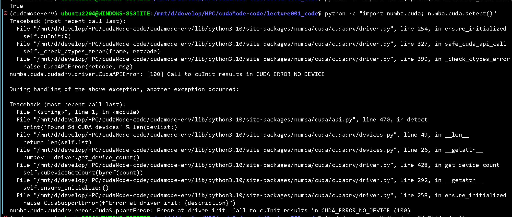

原因分析：

> Numba 比 PyTorch 更底层，它直接通过 ctypes 加载 libcuda.so，而 WSL2 的 libcuda.so 在特殊路径 /usr/lib/wsl/lib/ 下，Numba 默认搜索路径找不到。


解决方案：

```shell
ls -la /usr/lib/wsl/lib/libcuda.so*

sudo mkdir -p /usr/lib/x86_64-linux-gnu

sudo ln -sf /usr/lib/wsl/lib/libcuda.so.1 /usr/lib/x86_64-linux-gnu/libcuda.so

sudo ldconfig

python -c "import numba.cuda; numba.cuda.detect()"
```

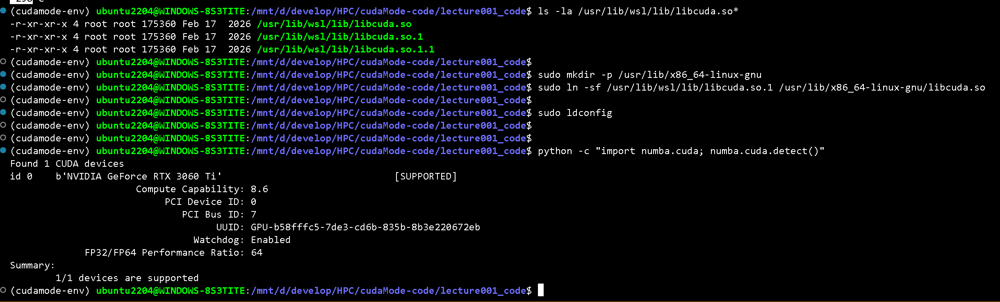

然后开始执行numba程序，出现问题：`numba.cuda.cudadrv.driver.CudaAPIError: [222] Call to cuLinkAddData results in CUDA_ERROR_UNSUPPORTED_PTX_VERSION` 。

把numba的版本降低，安装 numba==0.62

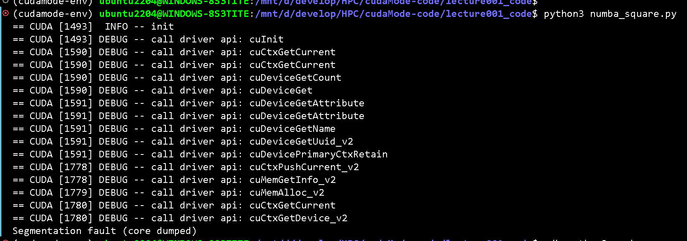


### Triton方式集成CUDA

triton 是OpenAI开发的一种基于块的一个DSL编程语言，不是Python的DSL，不会生成CUDA Kernel 程序的代码。而是生成PTX Kernel代码。PTX就是CUDA汇编代码。

所以使用triton版本写了一个square，从而展示

```python
import triton
import triton.language as tl
import torch

@triton.jit
def square_kernel(output_ptr, input_ptr, input_row_stride, output_row_stride, n_cols, BLOCK_SIZE: tl.constexpr):
    # The rows of the softmax are independent, so we parallelize across those
    row_idx = tl.program_id(0)
    # The stride represents how much we need to increase the pointer to advance 1 row
    row_start_ptr = input_ptr + row_idx * input_row_stride
    # The block size is the next power of two greater than n_cols, so we can fit each
    # row in a single block
    col_offsets = tl.arange(0, BLOCK_SIZE)
    input_ptrs = row_start_ptr + col_offsets
    # Load the row into SRAM, using a mask since BLOCK_SIZE may be > than n_cols
    row = tl.load(input_ptrs, mask=col_offsets < n_cols, other=-float('inf'))

    square_output = row * row
    
    # Write back output to DRAM
    output_row_start_ptr = output_ptr + row_idx * output_row_stride
    output_ptrs = output_row_start_ptr + col_offsets
    tl.store(output_ptrs, square_output, mask=col_offsets < n_cols)


def square(x):
    n_rows, n_cols = x.shape
    # The block size is the smallest power of two greater than the number of columns in `x`
    BLOCK_SIZE = triton.next_power_of_2(n_cols)
    # Another trick we can use is to ask the compiler to use more threads per row by
    # increasing the number of warps (`num_warps`) over which each row is distributed.
    # You will see in the next tutorial how to auto-tune this value in a more natural
    # way so you don't have to come up with manual heuristics yourself.
    num_warps = 4
    if BLOCK_SIZE >= 2048:
        num_warps = 8
    if BLOCK_SIZE >= 4096:
        num_warps = 16
    # Allocate output
    y = torch.empty_like(x)
    # Enqueue kernel. The 1D launch grid is simple: we have one kernel instance per row o
    # f the input matrix
    square_kernel[(n_rows, )](
        y,
        x,
        x.stride(0),
        y.stride(0),
        n_cols,
        num_warps=num_warps,
        BLOCK_SIZE=BLOCK_SIZE,
    )
    return y

```

用Triton写的square kernel， `torch.compile`, `naive torch`, `Triton` 实现的kernel在A100的性能对比：

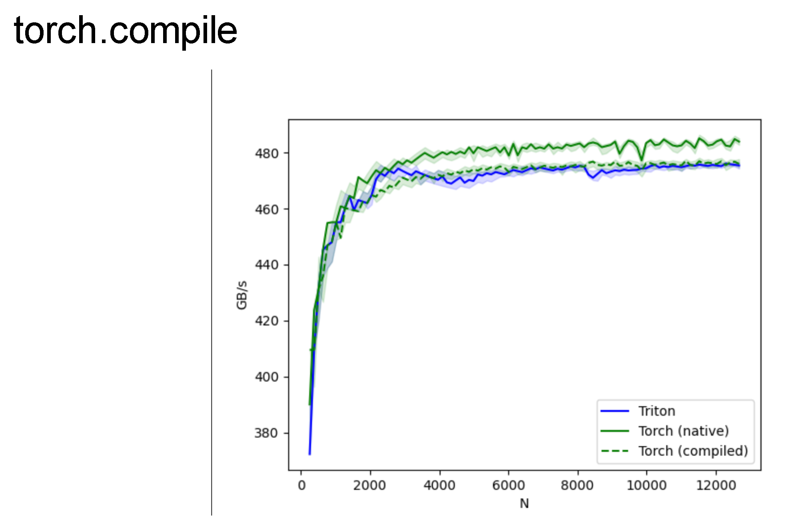

看到 `naive torch` 的kernel比Triton 和 `torch.compile` 生产的kernel都更快一点。torch.compile 会编译生成 OpenAI Triton Kernel。

课程作者在 RTX 4090 上测试结果依然如此：

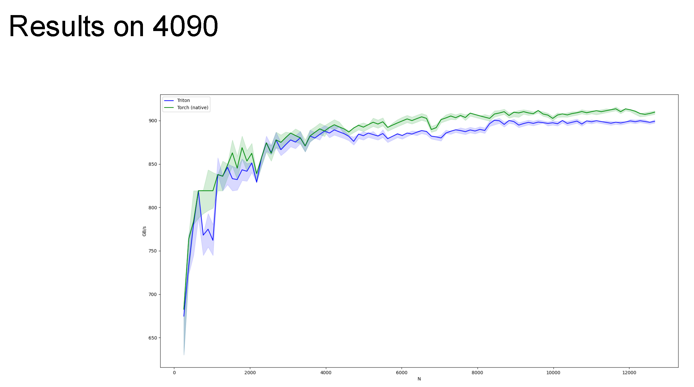

我使用RTX3060 Ti 硬件中，展示了 torch.compile, naive torch, Triton 实现的kernel性能结果：

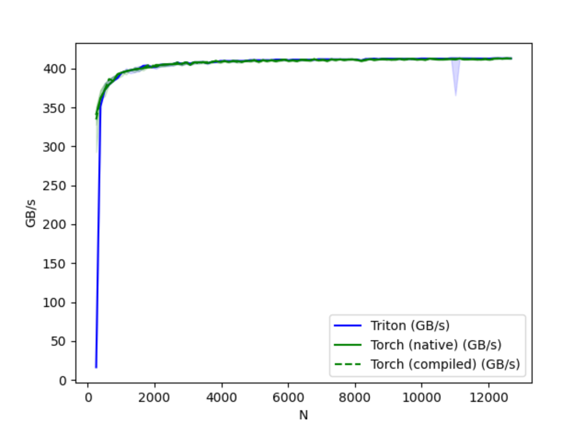

代码地址：https://github.com/gpu-mode/profiling-cuda-in-torch/blob/main/triton_square.py

这个 kernel是Triton的官方的fused softmax 教程：https://triton-lang.org/main/getting-started/tutorials/02-fused-softmax.html 改过来的，在那个教程里 Triton 的速度比 naive PyTorch 和 torch.compile 都要快，所以这里的性能表现有点奇怪，因为都是pointwise操作。

所以将代码中的线程块大小BLOCK_SIZE固定在1024（RTX 3060 Ti）中结果如下：

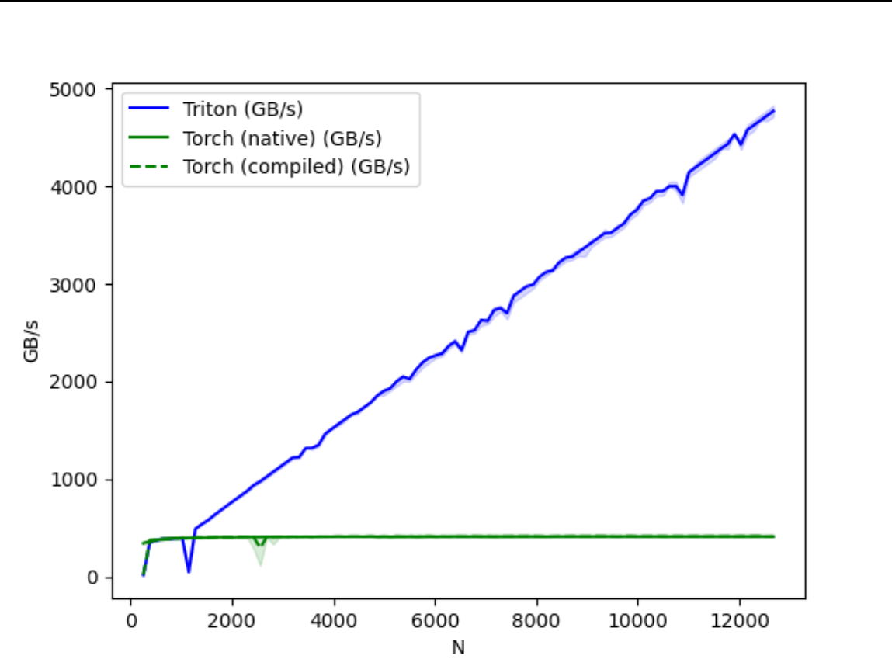

这里 Triton 的性能就完全逆转的夸张。但是BLOCK_SIZE固定后，对应的步长也是需要做出对应的调整。

## triton Debugger 工具
Triton中，使用 `@triton.jit(interpret=True)` 的方式，设定参数 `interpret=True` 就可以打开Debug方式，可以在任何位置加上Python断点，然后逐行检查代码或者信息等。几乎所有的变量都是 `WrappedTensor`，你可以使用`var_name.tensor` 来打印。

代码地址：https://gist.github.com/msaroufim/f849df30687708782e0269c4b42264b1

```python
@triton.jit(interpret=True)
def square_kernel(output_ptr, input_ptr, input_row_stride, output_row_stride, n_cols, BLOCK_SIZE: tl.constexpr):
    # The rows of the softmax are independent, so we parallelize across those
    row_idx = tl.program_id(0)
    # The stride represents how much we need to increase the pointer to advance 1 row
    row_start_ptr = input_ptr + row_idx * input_row_stride
    # The block size is the next power of two greater than n_cols, so we can fit each
    # row in a single block
    col_offsets = tl.arange(0, BLOCK_SIZE)
    breakpoint()
    input_ptrs = row_start_ptr + col_offsets
    # Load the row into SRAM, using a mask since BLOCK_SIZE may be > than n_cols
    row = tl.load(input_ptrs, mask=col_offsets < n_cols, other=-float('inf'))

    square_output = row * row
    breakpoint()
    # Write back output to DRAM
    output_row_start_ptr = output_ptr + row_idx * output_row_stride
    output_ptrs = output_row_start_ptr + col_offsets
    tl.store(output_ptrs, square_output, mask=col_offsets < n_cols)

```

## 平方Kernel的 PTX 代码

Triton Kernel版本写的square kernel中，生成对应的PTX文件，代码地址：https://github.com/gpu-mode/lectures/blob/main/lecture_001/square_kernel.ptx

> PTX从优化的角度来说，还是有用的。并不是说不用学。

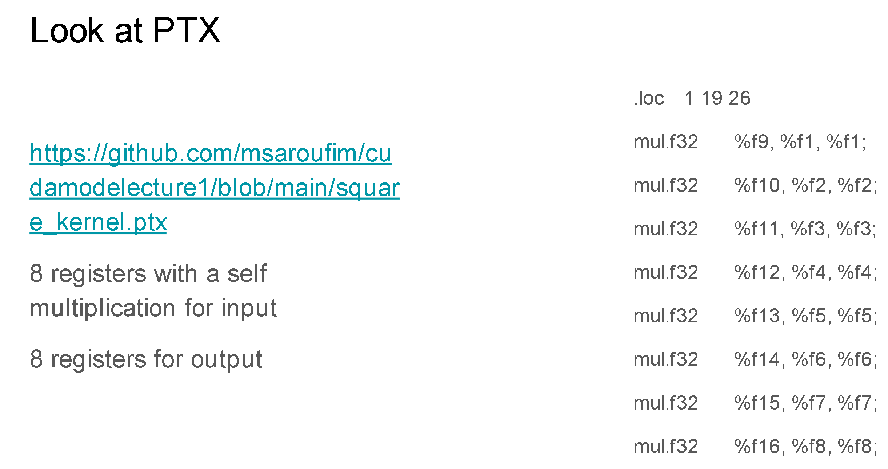

Triton每次计算，都会一次使用8个寄存器来对输入值进行平方计算，再使用8个寄存器来对输出值进行存储。在程序中可以观察到，有一些对全局变量（global Memory）或者 共享内存（Shared Memory）的操作。也可以看到线程ID，例如R25寄存器。

> 快速阅读PTX代码，直接让ChatGPT或者AI给你注释，然后辅助快速看懂和阅读代码。


## 生成Triton Kernel
对于kernel来说，与其手写，不如直接生成代码。在新的Pytorch机制中，通过 `torch.compile()` 来调用kernel，然后添加环境变量 `TORCH_LOGS = "output_code"` ，这个环境变量的目的：控制台打印输出torch为特定kernel编译生成的实际代码。

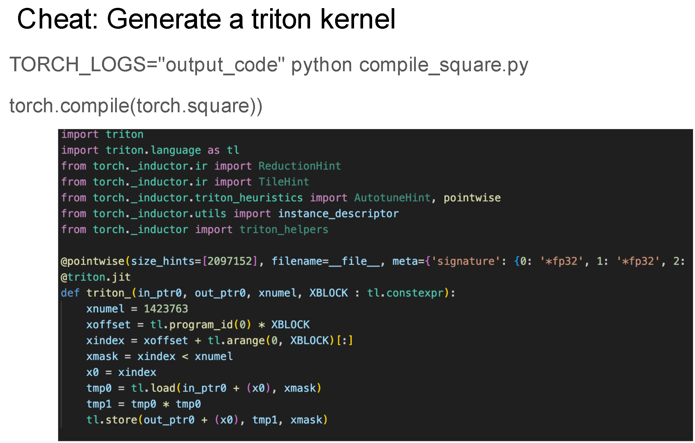

所以通过编写torch的方式，也可以直接生成对应的triton kernel代码，然后利用生成的Code作为起点，继续优化、学习和改进。

## ncu profiler

CUDA性能分析器，也就是NVIDIA Compute Profiler，也叫做ncu。下载链接：https://developer.nvidia.com/tools-overview/nsight-compute/get-started

```shell
ncu python3 train.py
```

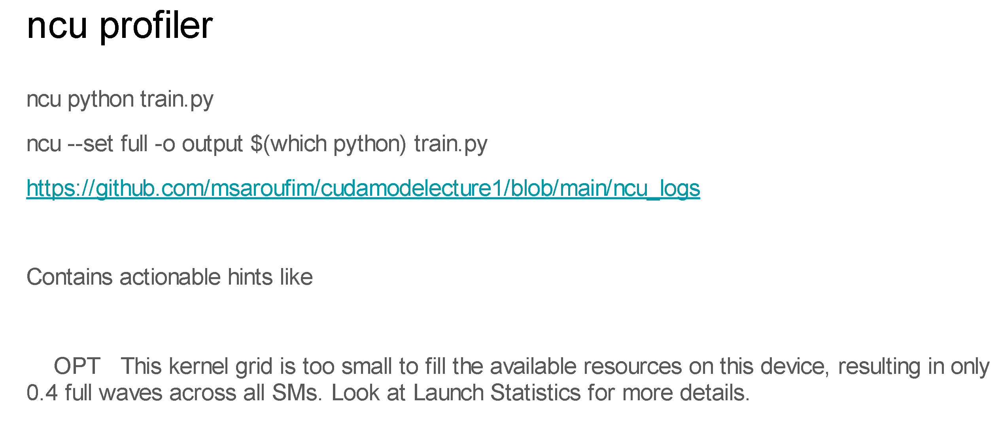

Slide中NCU log文件地址：https://github.com/gpu-mode/lectures/blob/main/lecture_001/ncu_logs

从这个ncu log日志中，可以看到一些信息：

- L1 Cache Throughput
- L2 Cache Throughput
- low compute throughput
- memory bandwidth utilization relative to peak (percent)

如果ncu指定 `--set full` 参数后，就可以直接ncu的可视化软件中查看profiler的结果。例如：

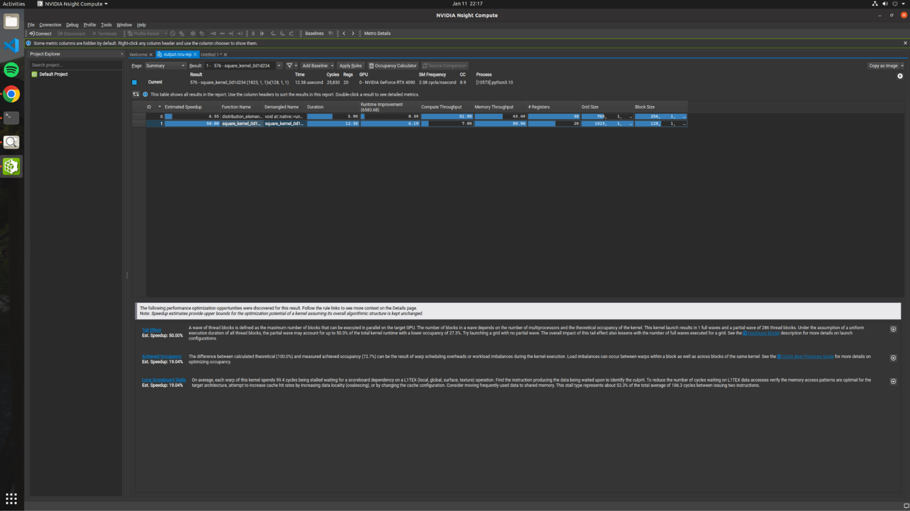

如果`kernel grid`太小，也就无法充分利用此设备上的可用资源，导致所有在SM上只有 0.4 个 `full waves`。从ncu可视化分析器的结果中，可以看到：`正在启动的kernel`、`内存吞吐量`、`计算吞吐量`、`寄存器`、`Grid Size`、`Block Size`等这些指标数据。

对于白框下面的，是ncu工具根据目前kernel的这些信息指标给出的粗浅的优化建议。

通过ncu profile的结果优化建议如下：

- tail effect + achieved occupancy 70% ：

    - 使用padding（填充）的方式进行控制。

- Long scoreboard stalls（长计分板停顿）

    - 合并读写操作，使用shared memory（不过此时的shared memory是triton控制的）来提升kernel性能。

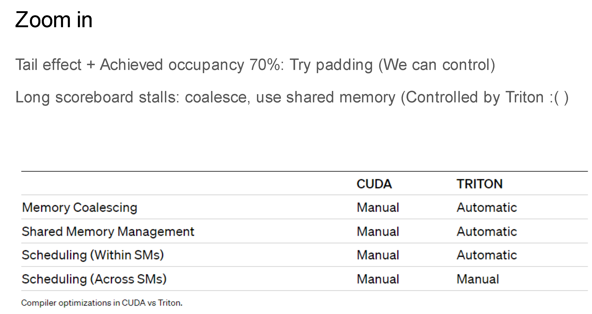


如果使用triton给一个功能写了kernel，可以控制70%左右的性能指标，如果想要获得额外的20%性能，如果你认为你在共享内存管理和内存访问合并等方面可以做得更好，就可以从torch升级到triton，再升级到CUDA，而不是直接从CUDA就开搞写出比triton更慢的kernel。


在Nsight Compute中，也有source 模式，可以看到triton kernel代码、CUDA PTX代码，在代码的旁边，也可以看到寄存器的占用情况。例如全局内存读取操作的情况。

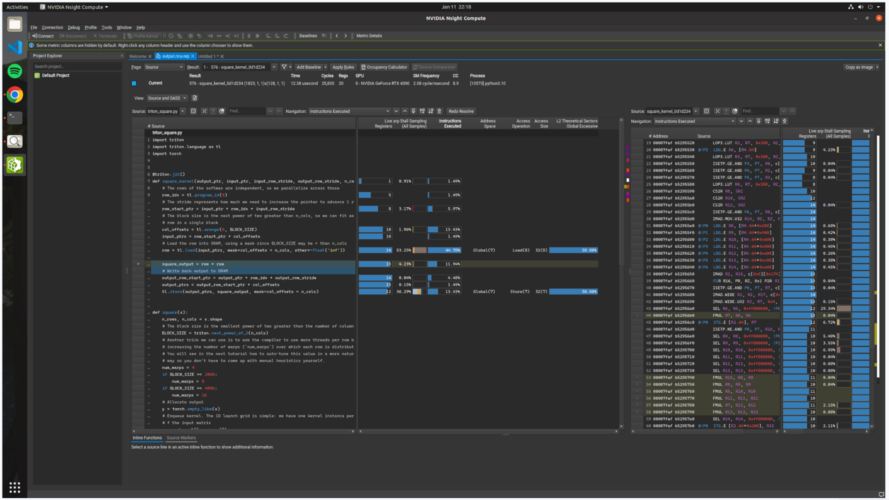

## 总结
集成一个自定义CUDA Kernel 和 triton kernel 比Pytorch的torch.compile 中更容易。从 Autograd profiler、Pytorch profiler 和 ncu profiler，基本上可以在CUDA方面够用。

triton的代码可读性很高，所以在一定程度上


## 参考资料

- Github Code : https://github.com/gpu-mode/profiling-cuda-in-torch

- Slide or PPT : https://docs.google.com/presentation/d/110dnMW94LX1ySWxu9La17AVUxjgSaQDLOotFC3BZZD4/edit?slide=id.p#slide=id.p

- Youtube Video : https://www.youtube.com/watch?v=LuhJEEJQgUM

- bilibili Video : https://www.bilibili.com/video/BV1QZ421N7pT/?spm_id_from=333.337.search-card.all.click&vd_source=cfac27016cff9d71ca0df49816411566


