<h1 align="center">📒 Recap Ch. 1-3 from the PMPP book 学习笔记</h1>


## 课程议题
- 概述
- 异构数据并行计算（Heterogeneous data parallel computing）
- 多维网格与数据（Multidimensional grids and data）


## PMPP CH2 : 概述

- 动机：GPU高速运转，在一定程度上尽可能多地计算，从而使得数据处理应用获得更高的FLOPS。

- 模拟和处理数据
    - 计算机中的世界模型（游戏、自动驾驶数据、天气预报、蛋白质折叠、机器人学等诸多领域中的应用）需要更多的数据

- 在AI领域中，模型越大也就越聪明，从而完成到AGI的跃变。通过GPU设备端侧中，通过Accelerator来推动整体的性能加速。
    - 治疗癌症
    - 解决气候预测问题

- GPU是现代深度学习的支柱，同时也是科学计算的支柱之一。

- 在经典软件的顺序编程时代。程序都是以一步一步执行，在一定程度上可以运行一段时间，但通过提高CPU的时钟频率，内存也越来越快，这是早期的发展模式。

- 在2003年，因为散热和功耗造成追求更高的时钟频率趋势放缓。也导致芯片上不能只通过时钟速度获得更高的速度。

- 进入并行化时代
    - 引入多核CPU时代
    - 开发者要学习多线程Multi-Threading，也就要求使用多线程化的方式来利用更多的CPU Core，引入了死锁、竞态条件（race condition）等。

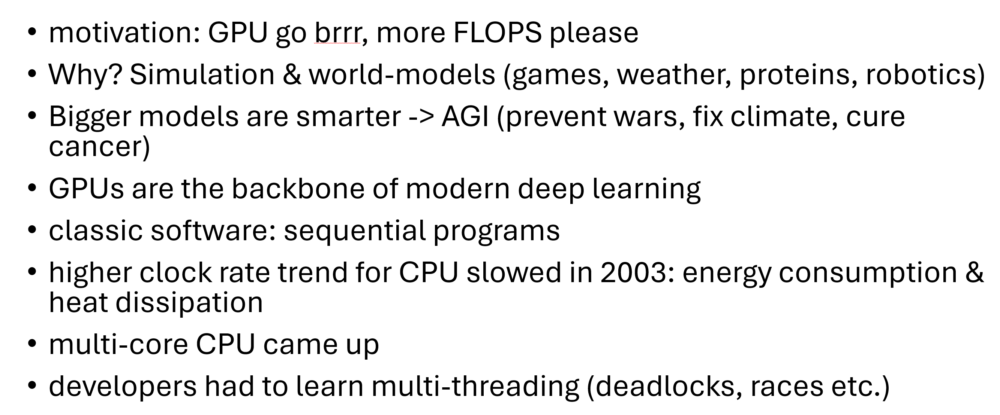

所以，在一定程度上，GPU的出现，是为了解决CPU无法解决的大规模计算的性能瓶颈问题。


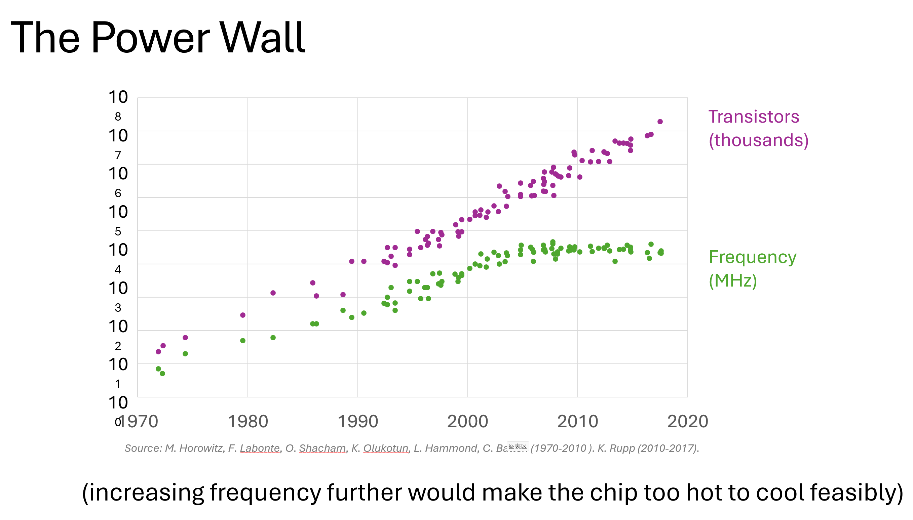

关于功耗墙的图中，展示了1970年到2020年的计算机芯片发展趋势中的两个关键参数：

- 晶体管数量（紫色）：以千为单位，呈指数增长趋势。从某个时刻开始，趋于平缓。
- 频率（绿色）：以MHz为单位，显示了处理器时钟速度的变化。

所以，这就是为什么频率到了一定阶段，就不再持续线性增长。进一步提高频率会使得芯片太热导致无法获得有效散热。这


### CUDA 的出现
因为功耗和散热的问题，引入多核并行化的方式来进行并行计算，这也是GPU CUDA出现的原因。显卡不再局限用于图形计算，所以CUDA也作为现代软件开发中中的并行编程。

所以CUDA为什么兴起？以及一些关键性的技术特性如下：

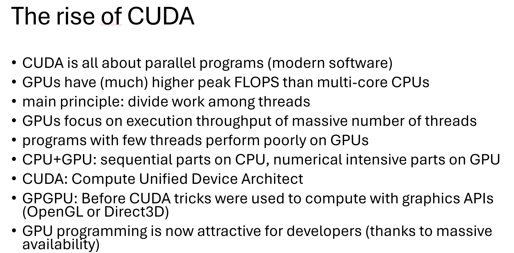


- CUDA作为一种并行编程程序，也是现代软件开发中的一种典型代表。

- GPU可以获得更高的峰值（FLOPS）比多核CPU更高。

- CUDA的主要原则是如何将工作分配给多个线程，然后利用这些线程并发地对数据进行处理。

- GPU中主要关注大规模线程的执行吞吐量，和CPU中的逻辑不同。
    - CPU中有自己的线程，但用于解决完全不同的事情，有自己的堆、栈资源。

- 线程数量较少的程序在 GPU 上性能较差

- CPU + GPU：CPU 执行顺序部分，GPU 处理数值密集型部分

- CUDA：统一计算设备架构（Compute Unified Device Architecture）

- GPGPU：在 CUDA 出现之前，图形 API（如 OpenGL 或 Direct3D）曾被用于计算。

如今，GPU 编程对开发者具有吸引力（得益于其广泛可用性）。

### CUDA编程中的一些挑战

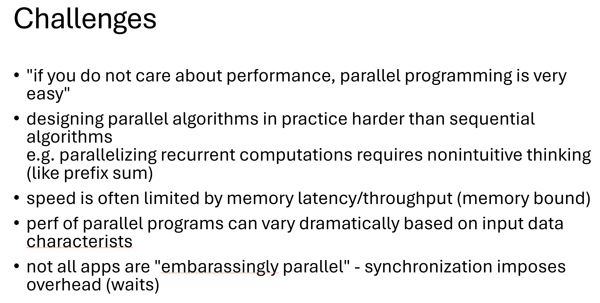


- 并行化编程很简单，但是如果不关注高性能，CUDA编程很简单。

- 在实战中，设计并行算法往往比顺序算法要难很多。

    - 例如，将递归计算并行化需要非直观的思维（如前缀和）。  

- 速度并不总是受限于处理器，往往是访问内存的带宽、内存读取速度、吞吐量等的限制。
    - 例如内存瓶颈，在LLM推理时代。

- 并行程序可能会因数据特征而存在较大的性能差异。
    - 例如：LLMs推理中，长度不同的序列，输入非常零散，所以要处理时，就会针对不同形状的数据Shape，有不同的优化kernels。

- 并非所有应用都“显式并行”
    - 在计算过程中，会有数据存在依赖关系，此时同步就会带来开销问题（等待时间）。


### PMPP这本书的目标
- 教会大家并行编程和计算思维的内容。
- 正确可靠：调试功能和性能
- 可扩展性：规范并本地化内存访问

PMPP的本意就是为通用并行编程奠定基础，通过GPU作为学习载体，书中一些技术同时也用于其它的GPU加速器。例如FPGA，还有网卡或者其它设备的内部也嵌入了加速器。书中也有很多CUDA形式的代码。

## PMPP CH2 : 异构数据并行计算

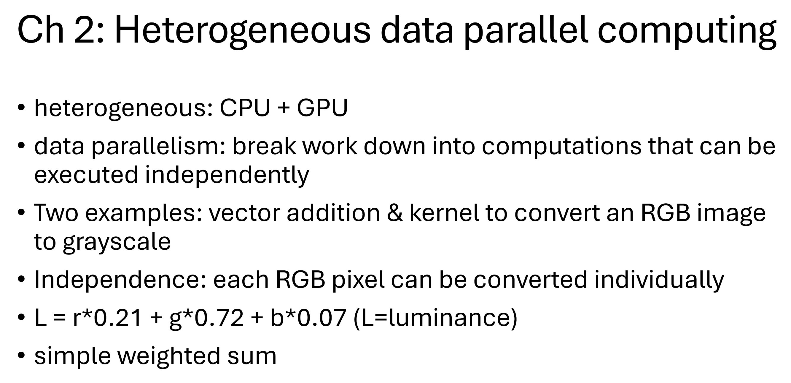


- **异构（Heterogeneous）** ：CPU和GPU协同计算。

- **数据并行性（Data parallelism）** ：将计算任务分解成可以独立执行的计算，实现数据的并行处理。

独立性是并行计算的基础，所以经典案例有：

- 向量加法
    - 并行计算中的常见案例。通过将向量的每个元素分别相加，可以并行处理，提高计算速度。

- 将RGB图像转换为灰度图
    - 通过一个应用kernel函数，每个像素的RGB（红、绿、蓝）值都可以独立计算其灰度值。公式为 $L = r*0.21 + g*0.72 + b*0.07$ ，其中L代表亮度（Luminance）。
    
    这个转换是基于人眼对不同颜色的感光敏感度不同，其中绿色部分权重最高。

所以，从下图中可以看出像素点的计算是具有独立性的。

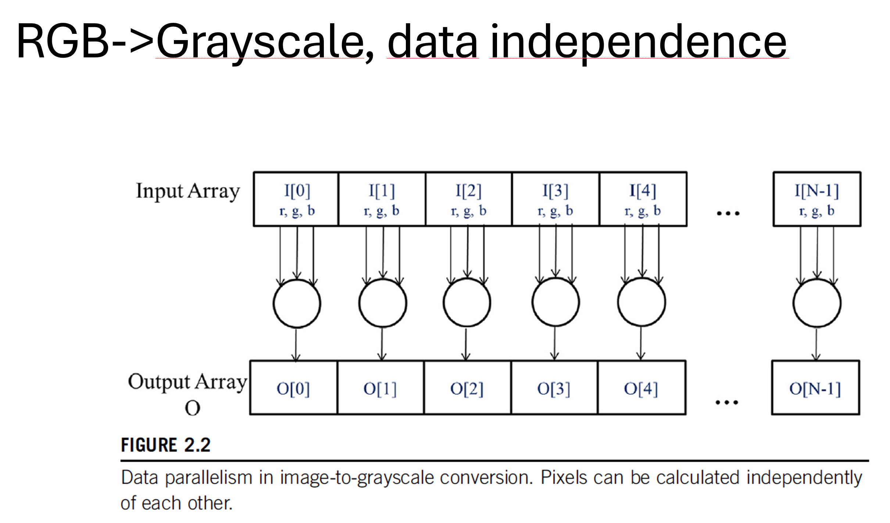

### CUDA C的特性
书中主要使用的是CUDA，CUDA C的一些特点：

- CUDA C是ANSI C编程语言中的一个扩展，增加了新特性的语法元素。
- 术语：CPU表示主机（Host）,GPU表示设备（Device）。
- CUDA C源代码可以是Host代码和Device代码的混合，所以在CPU和GPU中都可以运行。

- GPU上运行的代码，通常称为内核(kernels)，一种特殊形式的内核(kernels)函数。
- 在GPU上执行，启动执行一个Kernel，就使用线程网格(grid of threads)来执行内核,多个线程并行运行。
- CPU和GPU代码可以并发执行(重叠)，意味着在GPU上运行的kernel是异步执行。除非数据的来回拷贝需要等待结果，此时的CPU可以去执行其它任务。

- 在GPU上可以大量启动多个线程,不需要担心。可以启动达到数千或者数百万的线程，这也是硬件设计的目标。
- 对于输出张量的每一个元素启动一个线程是很正常的情况。


### 经典案例：向量加法（Vector Addition）

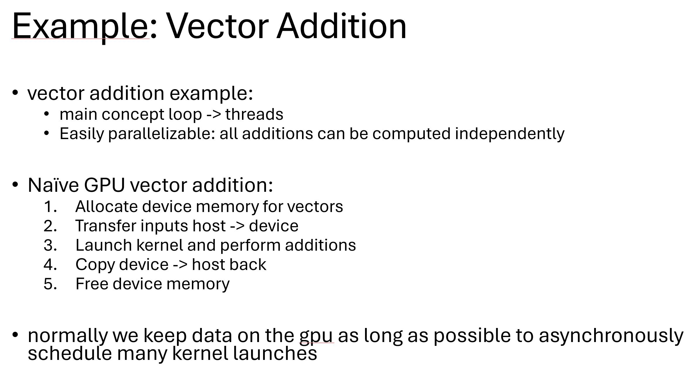

- 使用for循环来实现。

- 在经典CPU代码中，利用GPU来让其更快，就需要基本上的任务都外包给GPU。


易于并行化：所有加法操作均可独立计算  

- GPU向量加法实现的所有必要的执行步骤：

    - 在GPU上为向量分配设备内存，存放向量缓冲区
    - 将输入数据从主机传输到设备
    - 启动内核（Kernel）函数并执行实际的加法运算
    - 将结果从设备复制回CPU主机内存上
    - 释放设备内存

通常尽可能地保持数据在GPU上尽可能长的时间,以便于异步调度多个内核启动，从而可以最大限度地提高性能。

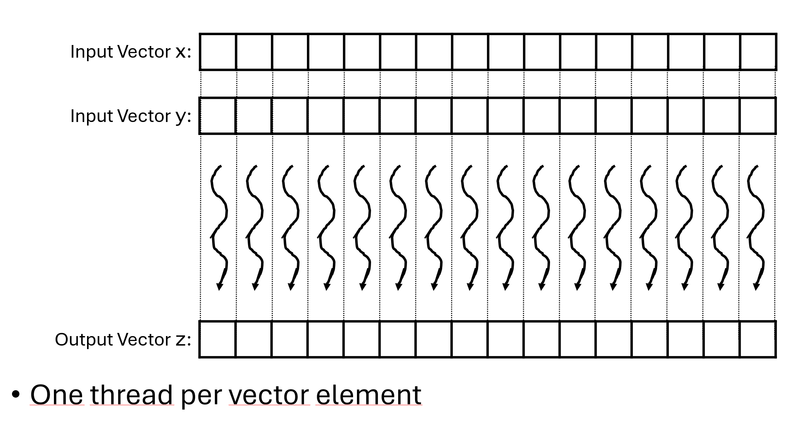

输入元素X和Y，每一个元素对应两个向量。这些元素都会对应地在GPU上启动一个线程，来计算输出向量。而且是相互独立进行计算的。


### CUDA 基本要素：内存分配
NVIDIA设备自带专用的DRAM(设备全局内存)。CUDA提供了两个重要的内存分配函数：

- `cudaMalloc()`: 在设备全局内存上分配内存空间。

- `cudaFree()`: 释放设备全局内存上的内存空间。

```c
// cudaMalloc & cudaFree 代码示例
float *A_d;
size_t size = n * sizeof(float); 	// size in bytes
cudaMalloc((void**)&A_d, size);	// pointer to pointer!
// ...
cudaFree(A_d);
```

对于内存分配大小的方式，和C语言的malloc方式一样，依然是使用`字节`的方式。区别就是：在CUDA中传入设备内存的指针（指向指针的指针，也就是设备指针的地址）。

> 在CUDA中，一般惯性使用：`_D` 用于设备端指针，`_H` 用于主机端指针。


### CUDA 内存拷贝函数：`cudaMemcpy()`
CUDA中内存搬运的API，包括 **`H2D（HostToDevice）`** 和 **D2H（DeviceToHost）** 。也就是说一些数据在CPU（Host端）中，需要将其拷贝到GPU（Device）上进行计算。

CUDA程序会先执行H2D的Memcpy把CPU数据搬运到GPU上，然后kernel执行完之后再把GPU计算结果通过D2H的Memcpy搬运回CPU主机端。

```c
// copy input vectors to device (host -> device)
cudaMemcpy(A_d, A_h, size, cudaMemcpyHostToDevice);
cudaMemcpy(B_d, B_h, size, cudaMemcpyHostToDevice);

// ... caculate some computation

// transfer result back to CPU memory (device -> host)
cudaMemcpy(C_h, C_d, size, cudaMemcpyDeviceToHost);
```

- source destination : 决定了数据的拷贝方向。也就是 `cudaMemcpyHostToDevice` 或者`cudaMemcpyDeviceToHost`。


### CUDA错误处理机制
CUDA函数执行完成后,会返回一个特殊的类型 `cudaError_t`。如果不是 `cudaSuccess`，则表示函数执行出现了错误问题。也可以通过查找这个错误代码获得它的字符串表示形式。

在编程时，一般都习惯始终检查 CUDA 函数的`返回值`，并处理可能出现的错误情况。

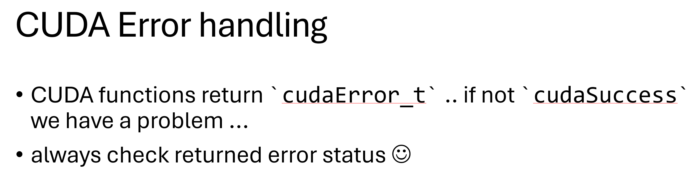

在课程代码案例（向量加法）：https://github.com/gpu-mode/lectures/blob/main/lecture_002/vector_addition/vector_addition.cu 中使用了错误处理机制：

```c
// https://stackoverflow.com/questions/14038589/what-is-the-canonical-way-to-check-for-errors-using-the-cuda-runtime-api
#define gpuErrchk(ans) { gpuAssert((ans), __FILE__, __LINE__); }
inline void gpuAssert(cudaError_t code, const char *file, int line, bool abort = true) {
  if (code != cudaSuccess) {
    fprintf(stderr, "GPUassert: %s %s %d\n", cudaGetErrorString(code), file, line);
    if (abort) {
      exit(code);
    }
  }
}
```

### CUDA Kernel函数: `fn<<...>>`

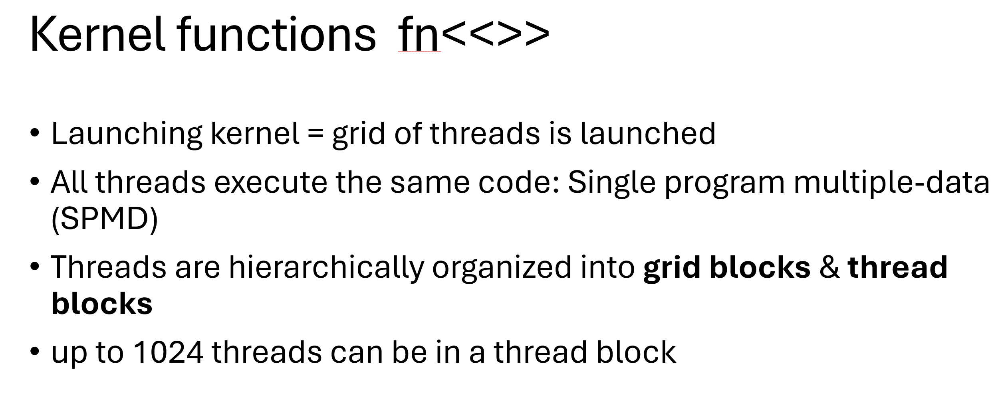

- 启动Kernel函数，意味着启动庞大数量的线程Grid，其中线程会同时进行计算。
- 所有的线程都用同一个程序进行计算，属于一个运行在多个数据上的单一程序。--- SPMD

- CUDA中，将线程分层组织的方式，分为 `Grid Blocks` 和 `Thread Blocks` 两种。

- 每个线程块可以启动的最大线程数是1024个线程。对于线程块中的这些线程可以访问相同的线程内存。


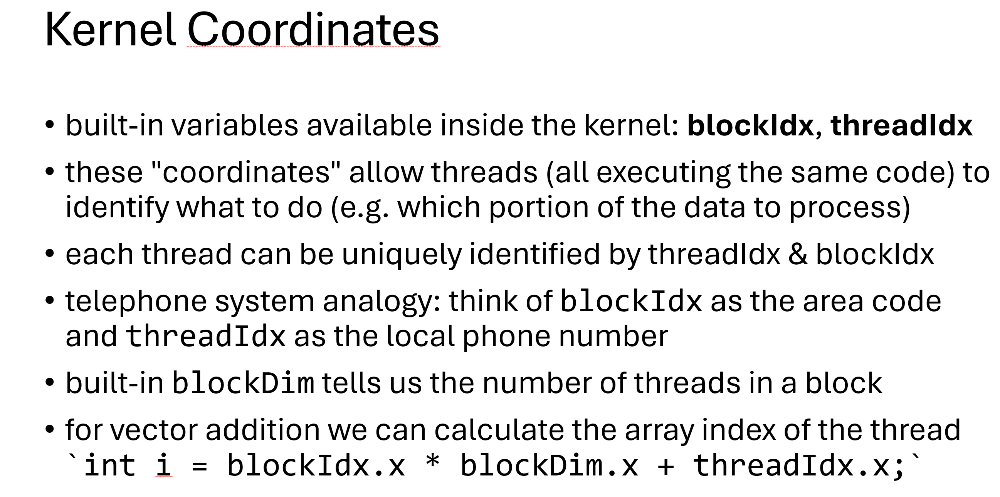

- 内核中可用的内置变量：`blockIdx`, `threadIdx`：这些在CUDA编程中，可以确定线程标识的位置。
    - `blockIdx` : 当前线程块的索引。
    - `threadIdx`: 当前线程在其所在块中的索引。

- 这些“坐标”在一个线程中，识别具体要做什么。
    - 使所有执行相同代码的线程能够确定各自要执行的操作（例如，处理数据的哪一部分）  

- 每个线程都通过 `threadIdx` 和 `blockIdx` 这两个变量作为唯一标识，从而知道要做什么，以及完成各自的执行任务。

- 电话系统类比：将`blockIdx`看作区号，`threadIdx`看作本地电话号码

- 内置的 `blockDim` : 每一个线程块中包含的线程数。


- 对于向量加法，可以计算出线程读写时的位置索引：

    ```c
    int i = blockIdx.x * blockDim.x + threadIdx.x;
    ```

对于线程来说，每个线程中执行相同的kernel代码，仅仅是因为数据的索引位置不同。

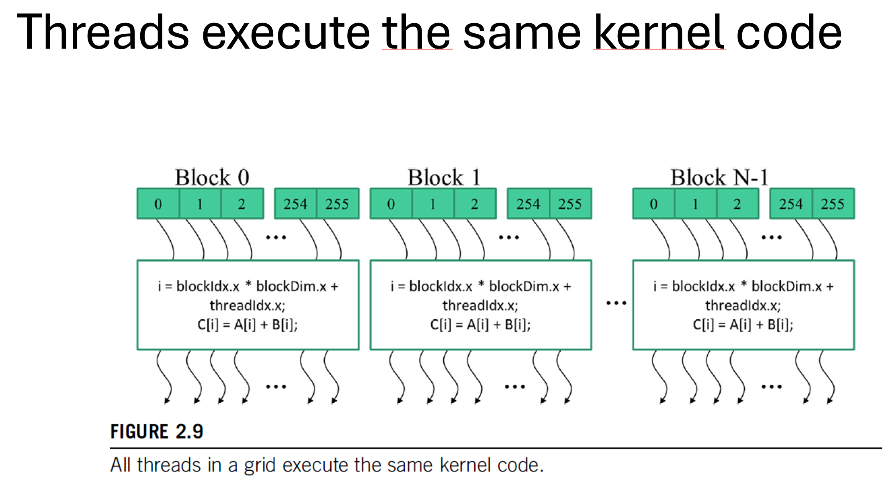


### `__global__` 和 `__host__`

这两个函数是为了向编译器表明这个函数位于哪个位置。


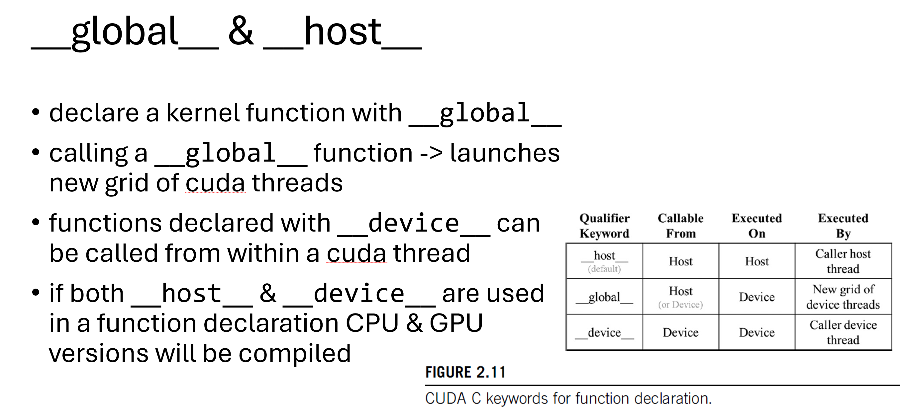

- `__global__` 限定符 ：声明内核（Kernel）函数

    - 调用 `__global__` 函数会启动一个新的 CUDA 线程网格（grid of cuda threads）

- `__device__` 限定符 ：声明的函数可以在 CUDA 线程内部被调用，但是不会启动新的CUDA线程
    - 在Device（GPU）端上执行。

- `__host__` 限定符 ：默认的函数限定符，通常不需要指定。
    - 直接从 Host（CPU）端调用

- 如果在函数声明中同时使用了 `__host__` 和 `__device__` ，则 CPU 和 GPU 版本都会被编译，从而生成GPU和CPU两个版本。


### Vector Addition 示例
- 总体策略
    - 用线程网格（grid of threads）替代循环。这是CUDA并行编程的核心思想。

- 数据大小
    - 数据大小可能无法被块大小直接整除，因此总是需要检查边界条件。

- 内存安全：防止边界块的线程读取或写入分配内存之外的数据，这是为了避免内存访问错误。


```c
// compute vector sum C = A + B
// each thread peforms one pair-wise addition
__global__
void vecAddKernel(float* A, float* B, float* C, int n) {
    int i = threadIdx.x + blockDim.x * blockIdx.x;
    if (i < n) {	// check bounds
        C[i] = A[i] + B[i];
    }
}
```

代码解释：

- 每个线程执行一次对应元素的加法操作
- 使用 `__global__` 修饰符声明kernel函数
- 函数参数包括输入向量A和B，输出向量C，以及向量长度n
- 使用线程和块的索引计算每个线程负责的元素位置
- 进行边界检查，确保不会访问超出向量范围的元素
- 执行实际的加法运算

### 调用kernel

Kernel的配置在 `<<<` and `>>>` 之间指定块数以及每个块中的线程数。

```c
dim3 numThreads(256);
dim3 numBlocks((n + numThreads - 1) / numThreads);
vecAddKernel<<<numBlocks, numThreads>>>(A_d, B_d, C_d, n);
```

代码说明：

- 设置每个块的线程数为256：dim3 numThreads(256)。

- 计算所需的块数：dim3 numBlocks((n + numThreads - 1) / numThreads)，确保了n不能被numThreads整除，也能覆盖所有的数据。

- 调用向量加法的Kernel


后续也会学习其他启动参数，如共享内存大小（shared-mem size）和CUDA流（cudaStream）。

### CUDA Compiler

- nvcc（NVIDIA C 编译器）用于将内核编译为 **PTX（Parallel Thread Execution，并行线程执行）**。

- PTX 是一种底层虚拟机和指令集，是一种类似汇编语言的代码格式。

- 图形驱动程序将 PTX 转换为可执行的二进制代码（SASS，Streaming Assembly），从而让SASS程序可以在GPU上执行。


## PMPP CH3 : 多维网格和数据

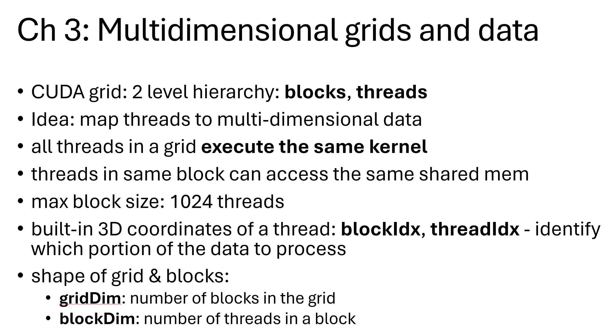


### CUDA Grid
可以在同一个设备上启动多个kernel。启动kernel的2D线程网格（Grid）和3D线程块（Block）的结构体示意图如下：

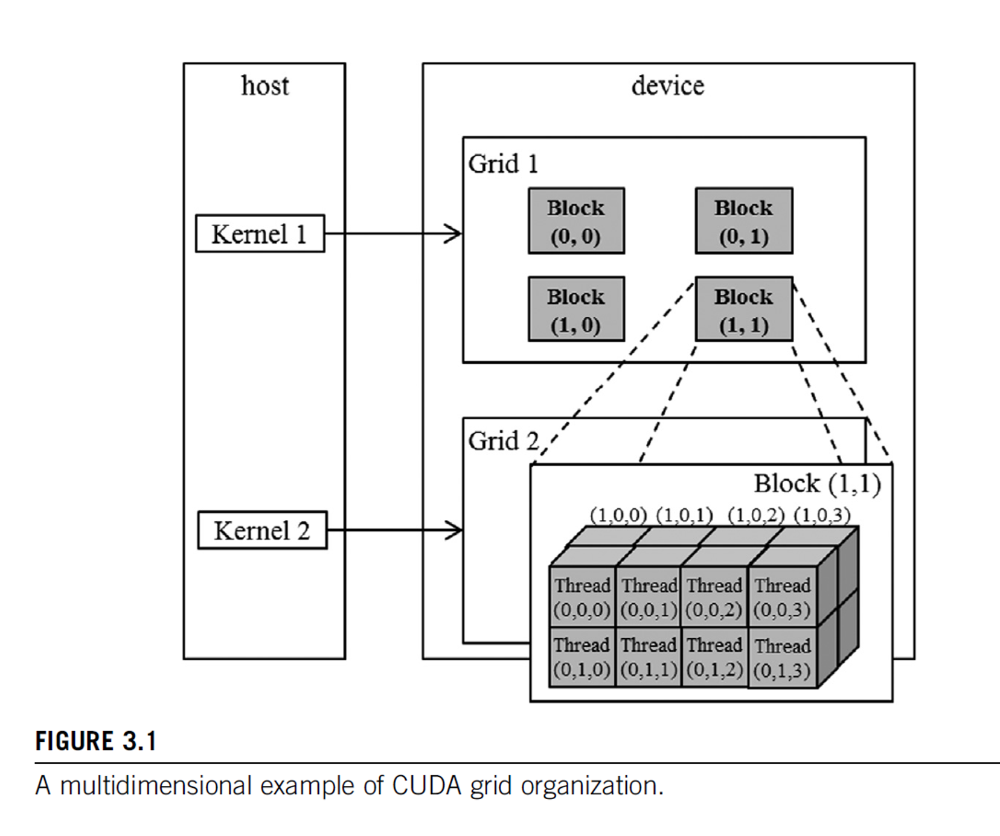


kernel是由不同线程块组成的Grid（网格），这些线程块都有对应的坐标，然后对应的3D立体结构的线程块中都有对应的位置索引（线程索引和块索引，通过这些索引信息来访问数据）进行计算。

- 每次内核启动可以使用不同的网格配置，例如根据数据形状来决定。

- 线程在GPU中很廉价，所以典型的网格包含数千到数百万个线程。

- 常见的策略：
    - 一个线程对应计算每个输出元素（如每个像素一个线程，每个张量元素一个线程）。

- 这些线程计算可以按任意顺序被调度执行。因为这是被CUDA内存模型规定的，除非使用同步操作，否则无法保证执行顺序。

- 可以使用少于3维的网格配置（未使用的维度设为1）。


例如：1D用于序列处理，2D用于图像处理等。

```c
dim3 grid(32, 1, 1); // 定义一个32个线程块的Grid
dim3 block(128, 1, 1); // 每个线程块一共有128个线程
kernelFunction<<<grid, block>>>(..);
// Number of threads: 128 * 32=4096
```

代码示例中，如何定义一个1D的网格和块配置，总共启动4096个线程。


### 多维数组在内存中的布局
在多维数据结构的多维数组中，每个元素在内存中都有特定的布局。但通常多维数组在内存中以一种扁平一维结构的布局。

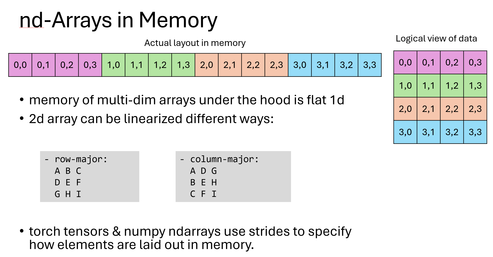

- 左侧表示实际的内存布局（一维）；右侧表示数据的逻辑视图（二维）

- 二维数组中有两种不同方式线性化方式：

    - 行主序（Row-major）：按行存储或者索引计算，如 ABC DEF GHI
    - 列主序（Column-major）：按列存储或者索引计算，如 ADG BEH CFI

数组在内存中是线性排列的，逻辑上，在矩阵中，列（row）表示元素依次排列。在Pytorch或者Numpy中，每个Tensor都会使用这两种方式，至于是行主序还是列主序的内存布局形式，主要取决于步长（步长定义了当前维度到下一个元素所需的距离）。

### 图形模糊（Images Blur）

这是一个计算图像的均值滤波器的示例：

代码地址：https://github.com/gpu-mode/lectures/tree/main/lecture_002/mean_filter

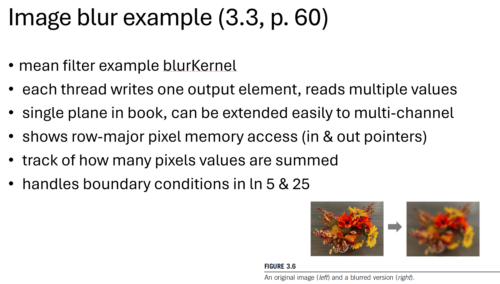


- 每个线程写入一个输出元素，读取多个值（读取时，使用for循环）
- 书中的案例是单个平面（指灰度图像），但可以轻松扩展到多通道（如RGB图像）。
- 显示按行主序（row-major）的像素内存访问方式（输入和输出指针）
- 跟踪有多少个像素和对应的值被相加，从而确定边界条件。

CUDA Kernel版本代码：

```c
__global__
void mean_filter_kernel(unsigned char* output, unsigned char* input, int width, int height, int radius) {
    int col = blockIdx.x * blockDim.x + threadIdx.x;
    int row = blockIdx.y * blockDim.y + threadIdx.y;
    int channel = threadIdx.z;

    int baseOffset = channel * height * width;
    // 处理边界问题
    // handles boundary conditions
    if (col < width && row < height) {

        int pixVal = 0;
        int pixels = 0;

        for (int blurRow=-radius; blurRow <= radius; blurRow += 1) {
            for (int blurCol=-radius; blurCol <= radius; blurCol += 1) {
                int curRow = row + blurRow;
                int curCol = col + blurCol;
                // 处理边界问题
                // handles boundary conditions
                if (curRow >= 0 && curRow < height && curCol >=0 && curCol < width) {
                    pixVal += input[baseOffset + curRow * width + curCol];
                    pixels += 1;
                }
            }
        }

        output[baseOffset + row * width + col] = (unsigned char)(pixVal / pixels);
    }
}
```

在代码中有对应的边界处理逻辑。而下图中，不同位置的像素，实际有效的像素可能不一样，所以边界位置也不一样。

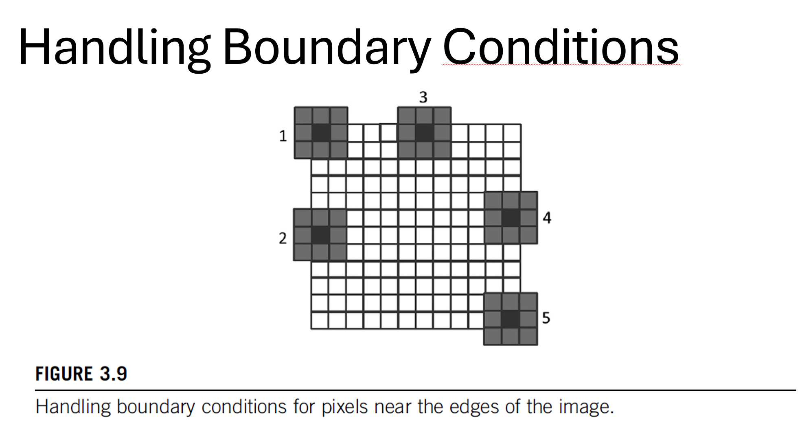


### 矩阵乘法（Matrix Multiplication）
矩阵乘法是科学领域的基石，也是计算工程学和深度学习的基石。而矩阵乘法中的主要操作是：对源矩阵的行和列做内积运算。

矩阵乘法公式：

$$ P=M\times N $$

输出矩阵中的一个元素：

$$ P_{row,col}=\sum_k M_{row,k}N_{k,col} $$

因此，计算 P[row][col] 时，需要：

- M 的第 row 行
- N 的第 col 列

让每个 thread 对应输出矩阵 P 中的一个元素。

> 策略：每个输出矩阵元素使用一个线程

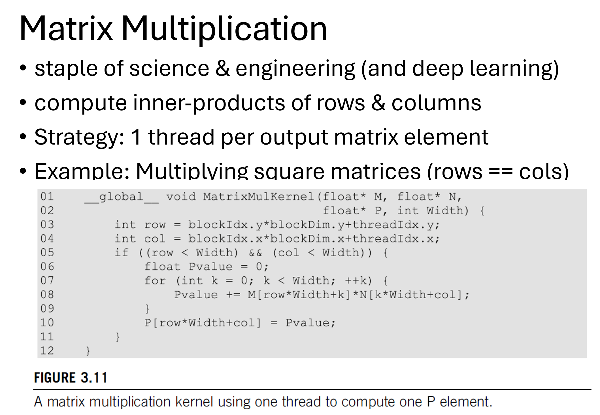


书中代码：

```c
// 为每个输出矩阵元素分配一个线程
__global__
void MatrixMulKernel(float* M, float* N, float* P, int width) {
    int row = blockIdx.y * blockDim.y + threadIdx.y;
    int col = blockIdx.x * blockDim.x + threadIdx.x;
    // 处理边界问题
    // handles boundary conditions
    if ((row < width) && (col < width)) {
        float Pvalue = 0;
        for (int k = 0; k < width; ++k) {
            Pvalue += M[row * width + k] * N[k * width + col];
        }

        p[row * width + col] = Pvalue;
    }
}
```

- 一个 CUDA Thread 负责计算 P 的一个元素。
- 一个 CUDA Block 负责 P 中一个 $BLOCK\_WIDTH × BLOCK\_WIDTH$ 的区域。

- 对于 Thread 对应的全局坐标：

    ```c
    // 对于全局位置的计算公式：全局位置 = Block位置 + Thread 局部位置
    int row = blockIdx.y * blockDim.y + threadIdx.y;
    int col = blockIdx.x * blockDim.x + threadIdx.x;
    ```

- Grid 中的多个 Blocks 最终覆盖整个输出矩阵 P。

总结：

- 一个 `Thread` 计算P的一个元素。

- 一个 `Block` 可以计算出P的一个小方块。所以 $BLOCK\_WIDTH×BLOCK\_WIDTH$ 个 Thread 就会计算 $BLOCK\_WIDTH×BLOCK\_WIDTH $ 个P元素。

示意图如下：

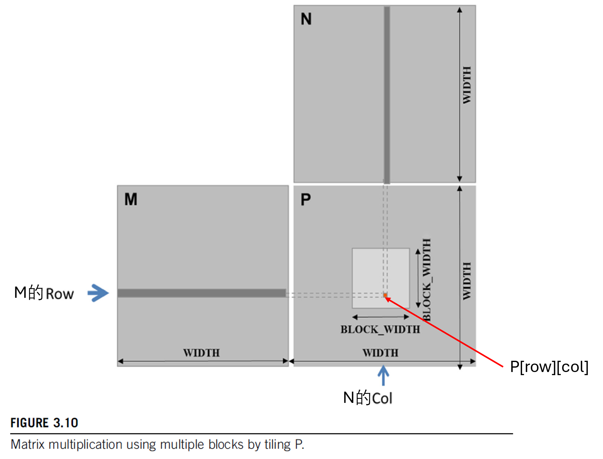


## 参考资料

- The Book : PMPP Chapter01 ~ Chapter03

- Github Code and Slides : https://github.com/gpu-mode/lectures/tree/main/lecture_002

- Youtube Video : https://www.youtube.com/watch?v=NQ-0D5Ti2dc

- bilibili Video : https://www.bilibili.com/video/BV1QZ421N7pT?spm_id_from=333.788.videopod.sections&vd_source=cfac27016cff9d71ca0df49816411566&p=2
